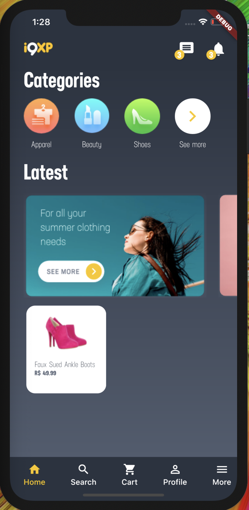
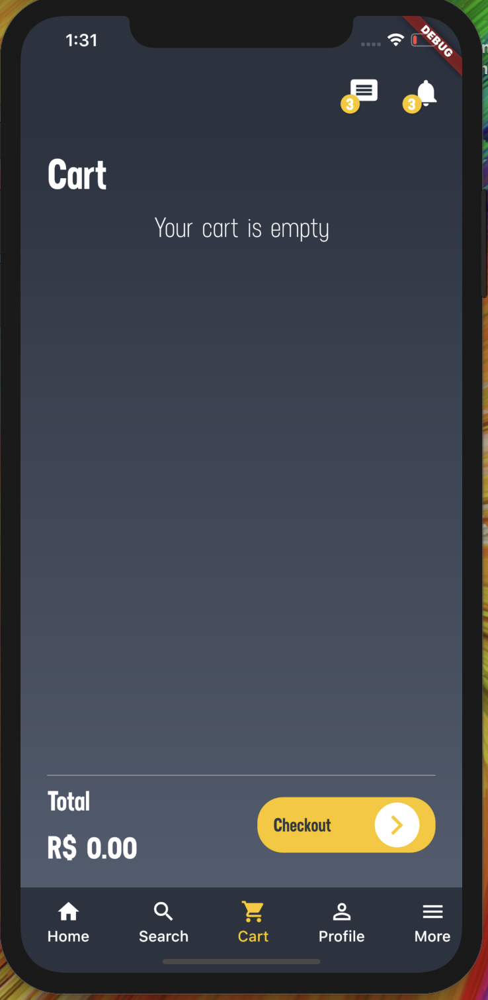
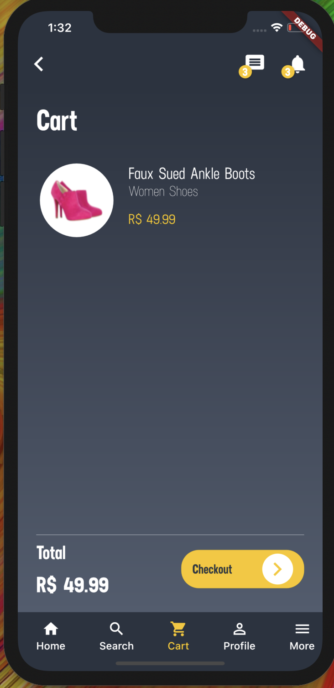
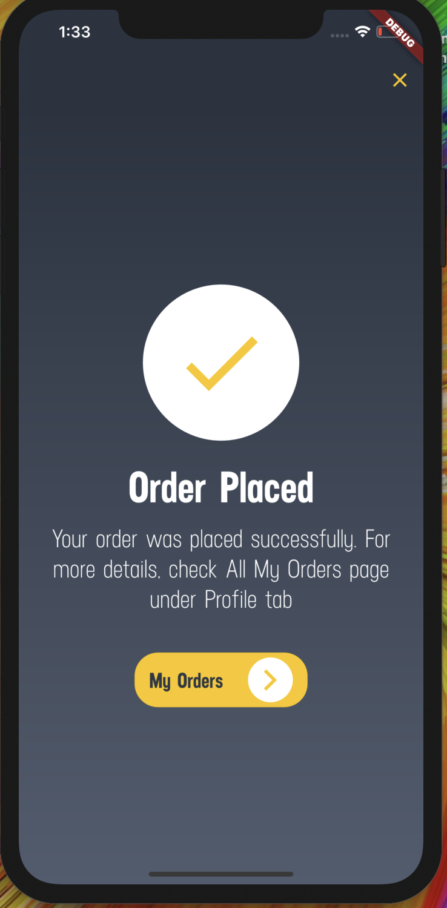

# Teste Mobile

## About the project

 This is a Flutter project that was made for i9xp selection process.

## Technologies
 
 - Firebase(Cloud firestore and storage) - To take informations about categories, products and banners.
 - Mobx - State Manegement
 - Hive - Local Storage(shopping-cart)
 - Slidy - Package manager

## Challenges
 
 The most difficult thing to me was the deadline, because I worked on Friday, so I didn't really have two days. Besides the question of the time, I had some problems with fonts and images, because of that I used other font at the project.

## Design

 
 Home
 
 
 Empty Cart 
 
 
 Product page
 
 
 Cart with product
 
 
 Order placed
 

